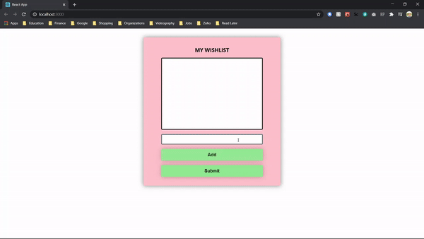
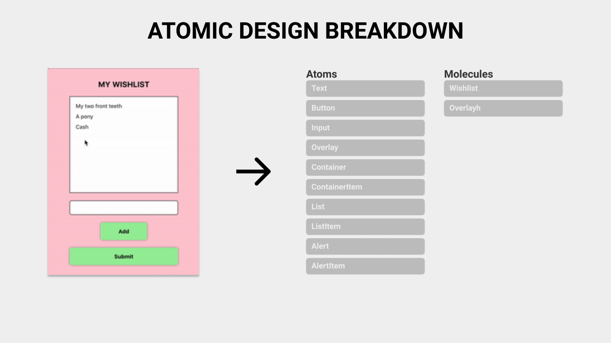
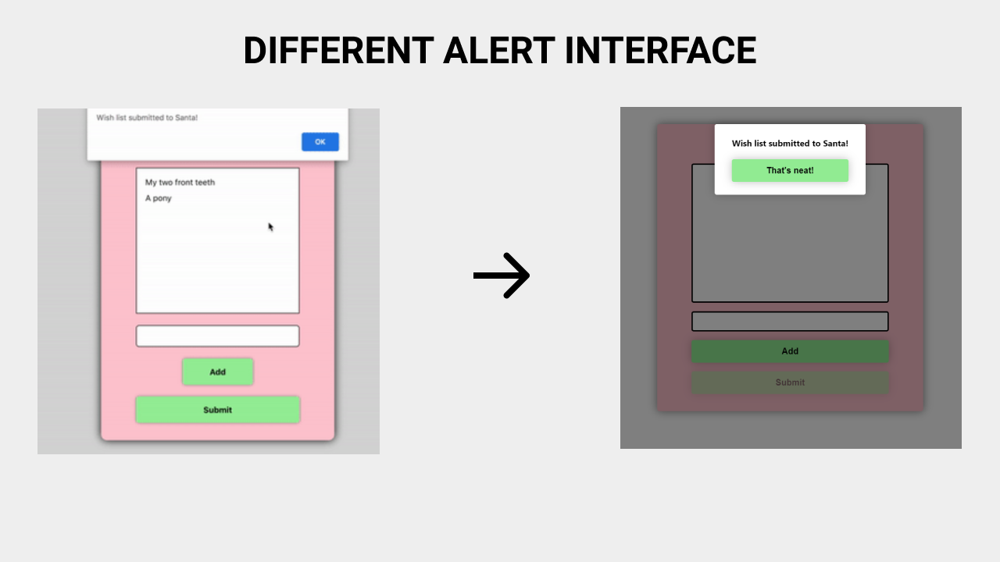
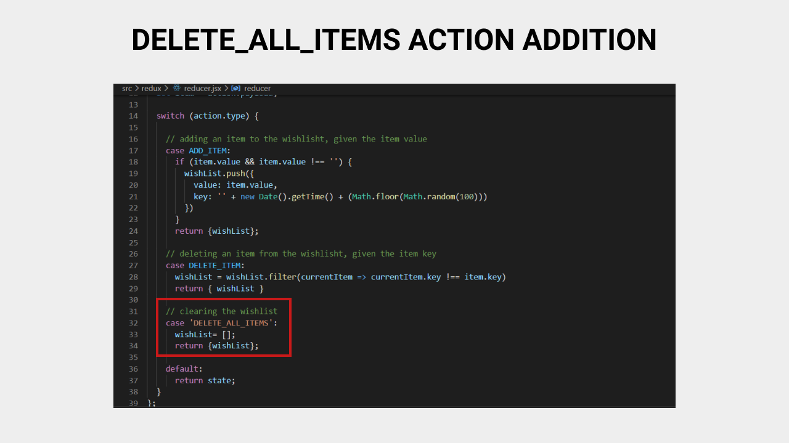

# Halo Developer Test

## Description
This repository contains my solution to the Developer Test provided by Halo. Below, I thought it would be useful to include my thought process, to help show how I approached this test.

## My Process
**The Process** 
After reading the prompt, the process I cam up with was pretty straightforward as outlined below:
1. Building the User Interface
2. Building the Logic
3. Add Responsiveness
4. Deployment

**1. Build the User Interface**
I like to organize my React components following loosely follow Brad Frost's Atomic Design methodology, where he separates the design elements into atoms, molecules, organisms, templates, and pages, with each element being more abstract as the levels go on. Of course this project didn't require that much complexity, so I didn't have to build anything beyond molecule-type components.

Usually, I would set up more clear file structure for more organization, but since the test wanted me to have most of my code within the `App.js` file, I just built the components inside there and separated them using comments.

I thought it would be boring to just show the use the default alert interface upon submission, so I just built some components and reused already existing components to keep everything in style.

Another you'll notice is my use of the `style-jsx` library (which I took the liberty to add as a babel plugin) throughout the components, just because I find it more convenient to be able write out inline styling along with the fact that the library protects against overlapping styling issues. It usually makes more sense when the components are divided into their own files, since now the component along with it's styling is all located within one style.

**2. Building the Logic**
I'll be honest, I hadn't touched Redux in a while, so I just did a quick review on how Redux handled state management, and how it relates in the context of React, and it was pretty easy connecting the item-adding and item-deleting features after that.

The only extra thing I did was add an an extra action to delete all the items for the submission feature, directly in the `reducer.js` file just to clear the wish list upon submission.

**3. Adding Responsiveness**
Although this usually isn't necessary when building the minimum, (which is why I save this toward end) I do think it's important to make web applications responsive to help guide the user's interactions and experience, and it's just generally fun. 

It wasn't much, but I added extra reactionary animations to some of the elements to help indicate guide the user when using the application.

**4.  Deployment**
Just for the sake of ease of access, I was going to set up an online deployment, but it seems that the original files were modified in a way that results in a broken build after running `npm run build`.

**What would I Could Have Done Better**
Looking back at it now, I probably could have done somethings better. I probably could have simplified the Container, ContainerItem, List, ListItem, Alert, and AlertItem components into more two more general purpose components since they all followed the same Container-Item type relationship, and it would have better aligned with both the DRY Principle and the Atomic Design Methodology when it comes to reusability.

I also probably should have implemented the `DELETE_ALL_ITEMS` action within the `actions.js` file since it would conform more to already preset conventions.

I also would have abstracted some of the logic into their own functions just to clean up some of the code, and so it wouldn't look to frustrating to read.

**Overall**
It was pretty fun, pretty simple test. Nice thing to do on a Friday.

